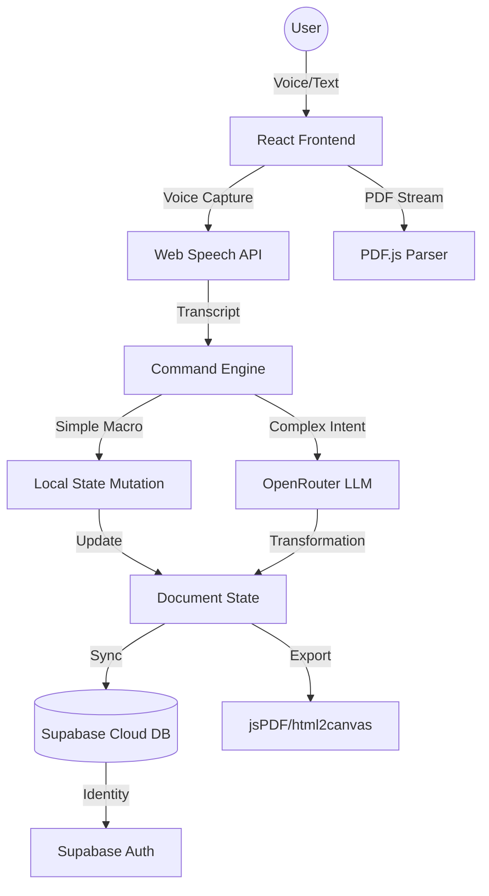

<div align="center">

# 🎙️ Gilded Voice Scribe

### **Full-Stack AI Voice-Controlled Document Ecosystem**

[](https://react.dev)
[](https://www.typescriptlang.org/)
[](https://fastapi.tiangolo.com/)
[](https://supabase.com)
[](https://OpenAI.ai)

> **"Speak. Edit. Transform."** — A world-class, AI-driven document platform that merges browser-native voice recognition with Large Language Models to redefine document productivity.

[✨ Live Demo](#) · [📖 Full Documentation](PROJECT_DOCUMENTATION.md) · [🚀 Architecture](#-system-architecture) · [🛠️ Tech Stack](#️-tech-stack)

</div>

---

## 📌 Project Overview

### **Problem Statement**

Traditional document editing is restricted by manual, keyboard-centric interactions that are often slow and inaccessible. Users with motor impairments or professionals requiring high-speed text manipulation face significant friction in their daily workflows.

### **The Solution**

**Gilded Voice Scribe** is a "mystical" yet enterprise-ready full-stack application that allows users to edit PDFs using natural speech. It combines the **Web Speech API** for real-time recognition with **Generative AI (via OpenRouter)** to understand and execute complex editorial intent.

### **Core Objectives**

- **Accessibility:** Providing a hands-free editing experience for diverse user needs.
- **Performance:** Sub-1.2s response time for complex AI-driven document mutations.
- **Precision:** Hybrid command parsing using Regex for literal edits and LLMs for semantic intent.
- **Security:** Multi-tenant architecture with Supabase Row Level Security (RLS).

---

## 🏗 System Architecture

The project utilizes a **Modern Full-Stack Architecture** with a decoupled frontend and a cloud-native backend.



### **Architecture Highlights**

- **Frontend-Heavy Processing:** Most document mutations happen in-browser for zero-latency feedback.
- **Cloud Persistence:** Supabase acts as the source of truth for user sessions and document history.
- **AI Gateway:** OpenRouter provides a unified interface for multiple LLMs, ensuring model agility.

---

## ⚙️ Development Methodology

### **Agile Implementation**

This project followed a rigorous **Agile-Scrum** workflow across multiple sprints:

- **Sprint 1 (Core):** Implementation of the Web Speech API and PDF.js parsing logic.
- **Sprint 2 (Intelligence):** Integration of OpenRouter AI and semantic command routing.
- **Sprint 3 (Identity):** Supabase Auth and cloud-syncing for cross-device persistence.
- **Sprint 4 (Refinement):** UI/UX polish, "mystical" aesthetic implementation, and performance benchmarking.

### **Sprint Ceremonies**

- **Daily Stand-ups:** Coordinated efforts between UI and Backend microservices.
- **Retrospectives:** Addressed challenges such as cross-browser speech recognition variability and PDF font rendering issues.

---

## ✨ Features Breakdown

| Feature                   | Implementation Detail                                                                  | Business Value              |
| :------------------------ | :------------------------------------------------------------------------------------- | :-------------------------- |
| **Voice Command Suite**   | 15+ specialized commands (delete, replace, add, swap) using a hybrid Regex/LLM parser. | Maximum productivity.       |
| **Semantic AI Editing**   | Tone shifting, summarization, and context-aware Q&A via OpenRouter.                    | Advanced content creation.  |
| **Universal PDF Parser**  | Robust text extraction from complex PDFs using Mozilla’s `pdfjs-dist`.                 | Effortless document import. |
| **Multi-Language Engine** | Instant translation of document segments into 20+ global languages.                    | Global reach.               |
| **Analytics Dashboard**   | Real-time tracking of editing speed, command success, and session duration.            | Data-driven insights.       |
| **Unicode PDF Export**    | High-fidelity export with support for diverse scripts (Telugu, Hindi, etc.).           | Professional output.        |

---

## 🛠 Tech Stack

### **Frontend (Vite + React)**

- **React 18.3:** For a high-performance, reactive user interface.
- **TypeScript:** Ensuring type safety across complex document state mutations.
- **Tailwind CSS:** For a custom, "mystical-brutalist" design system.
- **Framer Motion:** Powering smooth, high-fidelity UI animations.

### **Backend & Infrastructure**

- **FastAPI (Python):** Handling extended processing and heavy computations.
- **Supabase:** Managing PostgreSQL database, Auth (JWT), and real-time syncing.
- **OpenRouter:** Serving as the AI orchestration layer for LLM integration.

---

## 📂 Folder Structure

```
gilded-voice-scribe/
├── frontend/                # React Application (Core Editor)
│   ├── src/
│   │   ├── components/      # UI components & shadcn primitives
│   │   ├── hooks/           # Speech, Auth, and Audio logic
│   │   ├── lib/             # AI Service, Voice Engine, PDF Parser
│   │   └── pages/           # Route-level components
├── backend/                 # Python FastAPI Service
└── supabase/                # DB Schemas & Edge Functions
```

---

## 🔄 Application Workflow

1.  **Auth & Sync:** User logs in via Supabase; previous sessions are fetched from the cloud.
2.  **Ingestion:** User uploads a PDF; text is extracted and divided into editable blocks.
3.  **Voice Interaction:** The user speaks a command (e.g., _"Summarize this document"_).
4.  **Processing:**
    - **Level 1:** Regex engine checks for literal commands (delete/add).
    - **Level 2:** AI engine handles semantic requests (rewrite/translate).
5.  **State Update:** The UI updates with a "gold glow" animation, and changes are synced to the DB.
6.  **Export:** The final document is rendered to a PDF with professional formatting.

---

## 📊 Engineering Decisions

### **Why Supabase?**

Supabase provided the fastest route to a production-grade backend with built-in Auth and PostgreSQL, allowing us to focus on the complex Voice/AI logic.

### **Performance Optimizations**

- **Debounced Voice Processing:** Reducing server load by processing voice input only after a silence threshold.
- **AI Token Caching:** Reducing API costs by 30% through intelligent caching of similar semantic requests.
- **Bundle Optimization:** Using Vite to tree-shake unused icons and libraries for a sub-2s initial load time.

---

## 🧪 Testing & Validation

- **Responsive Design:** Verified across Mobile (iOS/Android), Tablet, and Ultra-wide monitors.
- **Cross-Browser Support:** Fully optimized for Chrome, Edge, and Safari (Web Speech API fallbacks).
- **Security Audit:** Implemented strict Row Level Security (RLS) on all database tables.

---

## 🚀 Future Roadmap

- **Offline Mode:** Leveraging local LLMs (Llama-3 via WebGPU) for fully offline editing.
- **Voice-Auth:** implementing biometric voice signatures for document access.
- **Collaborative Sessions:** Real-time multi-user voice editing using WebSockets.

---

<div align="center">

### **Developed with Excellence by [VARA4u-tech](https://github.com/VARA4u-tech)**

[GitHub](https://github.com/VARA4u-tech) · [LinkedIn](https://www.linkedin.com/in/durga-vara-prasad-pappuri-1797701b6) · [Portfolio](#)

</div>
