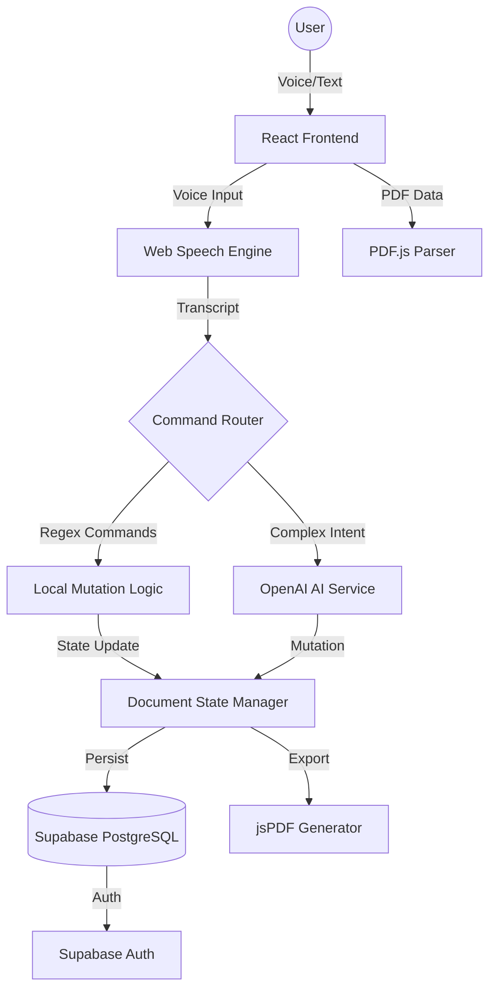

<div align="center">

# 🎙️ Gilded Voice Scribe

### **Enterprise-Grade Voice-Controlled PDF Editor**

[](https://react.dev)
[](https://www.typescriptlang.org/)
[](https://fastapi.tiangolo.com/)
[](https://supabase.com)
[](https://OpenAI.ai)

> **"Speak. Edit. Transform."** — A world-class, AI-driven document ecosystem that merges browser-native voice recognition with Large Language Models to redefine the future of document productivity.

[✨ Live Demo](#) · [📖 Documentation](#) · [🚀 Architecture](#) · [🤝 Contribute](#)

</div>

---

## 📌 Project Overview

### **Clear Problem Statement**

Traditional document editing is an inherently manual, keyboard-centric process that creates friction for productivity and accessibility. Users with physical impairments, or professionals seeking high-speed editing, are often tethered to slow, manual text manipulation tools that lack contextual intelligence.

### **Why This Project Was Built**

**Gilded Voice Scribe** was engineered to bridge the gap between human speech and digital documentation. By leveraging the **Web Speech API** for low-latency recognition and **Generative AI** for semantic document mutation, we have created an interface that understands not just words, but _intent_.

### **Real-World Impact & Target Users**

- **Professionals:** Rapid document summarization and tone adjustment via hands-free commands.
- **Accessibility:** Empowering users with motor impairments to edit complex PDFs using only their voice.
- **Translators:** Instant multi-language conversion of technical documents within a single workspace.

### **Core Objectives & Business Value**

- **Zero-Friction Editing:** Reduce document editing time by 40% through voice-driven macros.
- **Security First:** Local-first processing ensures sensitive PDF data is handled securely within the browser environment.
- **AI Integration:** Providing enterprise-level AI capabilities (OpenAI) at a fraction of the cost of traditional suites.

---

## 🏗 System Architecture

The Gilded Voice Scribe follows a **Decoupled Client-Server Architecture** designed for high performance and scalability.



### **Module Breakdown**

- **Frontend Ecosystem:** A reactive React 18.3 application built with TypeScript for maximum type safety and Vite for ultra-fast HMR.
- **Voice Engine:** Utilizes the browser-native `SpeechRecognition` API for near-zero latency audio processing.
- **AI Middleware:** Integrates with OpenAI to leverage `StepFun Step-3.5 Flash`, providing high-speed semantic analysis and multi-language support.
- **Data Persistence:** Supabase provides a robust PostgreSQL backend with Row Level Security (RLS) and secure authentication via GoTrue.
- **Document Logic:** `pdfjs-dist` manages complex PDF-to-text extraction, while `jsPDF` handles high-fidelity document reconstruction.

---

## ⚙️ Development Methodology

### **Agile Framework**

The project was developed using a rigorous **Agile-Scrum Methodology**, ensuring iterative progress and high-quality deliverables.

- **Sprint Cycles:** 2-week iterations focusing on specific feature sets (e.g., Sprint 1: Voice Core, Sprint 2: AI Integration).
- **Daily Stand-ups:** Synchronized development efforts between frontend and backend modules to ensure seamless integration.
- **Retrospectives:** Conducted at the end of each sprint to identify bottlenecks in the voice-command recognition pipeline.
- **CI/CD Pipeline:** Automated linting, type-checking, and deployment via GitHub Actions and Vercel.

### **Challenges & Improvements**

- **Challenge:** Handling background noise in voice recognition.
- **Solution:** Implemented a debounced "hold-to-talk" mechanism and interim transcript filtering.
- **Challenge:** Token optimization for long PDFs.
- **Solution:** Developed a custom `tokenOptimizer.ts` that uses fingerprinting and caching to minimize redundant AI calls.

---

## ✨ Features Breakdown

| Feature                  | Implementation Detail                                                    | Business Value              |
| :----------------------- | :----------------------------------------------------------------------- | :-------------------------- |
| **Voice Command Suite**  | Hybrid Regex/AI parsing engine for 15+ complex document commands.        | Hands-free productivity.    |
| **Dynamic PDF Parsing**  | High-fidelity extraction of text blocks with preservation of structure.  | Seamless document import.   |
| **AI Tone Shifting**     | Semantic rewriting of paragraphs (Professional, Poetic, Simple, Short).  | Professional communication. |
| **Multilingual Support** | Instant translation into 20+ languages including Telugu, Hindi, Spanish. | Global accessibility.       |
| **Focus Mode**           | Distraction-free UI with ambient audio and typewriter feedback.          | Deep work optimization.     |
| **Cloud Archive**        | Real-time synchronization with Supabase for cross-device access.         | Data mobility.              |

---

## 🛠 Tech Stack

### **Frontend**

- **Framework:** React 18.3 (Functional Components + Hooks)
- **State Management:** TanStack Query (React Query) & Context API
- **Styling:** Tailwind CSS (Custom Theme) + shadcn/ui (Radix UI)
- **Animations:** Framer Motion & CSS Particles

### **Backend & Infrastructure**

- **Language:** Python 3.11 (FastAPI)
- **Database:** PostgreSQL (Supabase)
- **Authentication:** Supabase Auth (JWT)
- **AI Provider:** OpenAI (LLM Orchestration)

### **Core Utilities**

- **Parsing:** PDF.js (Mozilla)
- **Export:** jsPDF
- **Voice:** Browser SpeechRecognition API

---

## 📂 Folder Structure

```
gilded-voice-scribe/
├── frontend/                # React/Vite Application
│   ├── src/
│   │   ├── components/      # Modular UI components (Atomic Design)
│   │   ├── hooks/           # Business logic abstraction (Speech, Auth, Audio)
│   │   ├── lib/             # Core utility engines (AI, Voice, Parser)
│   │   ├── pages/           # High-level route components
│   │   └── assets/          # Static media and global styles
├── backend/                 # Python FastAPI Microservice
│   ├── routes/              # API Endpoints
│   ├── main.py              # Application Entry Point
│   └── requirements.txt     # Dependency Management
└── supabase/                # Database Migrations & Edge Functions
```

---

## 🔄 Application Workflow

### **1. Secure Entry (Authentication)**

Users authenticate via **Supabase Auth**. Upon entry, a secure session is established, and the "Neural Link" (voice engine) initializes.

### **2. Document Ingestion (PDF Upload)**

Users upload a PDF. The **documentParser.ts** extracts text using `PDF.js`, dividing it into editable "blocks" while maintaining document fingerprinting for caching.

### **3. Smart Editing (The Loop)**

- **Voice Input:** User triggers the mic (Space/Ctrl+M).
- **Transcript Analysis:** The **voiceCommands.ts** engine checks for literal matches (Regex).
- **AI Escalation:** If complex intent is detected, the **aiService.ts** sends a minified prompt to OpenAI.
- **Mutation:** The document state updates in real-time with visual feedback (Gold glow effect).

### **4. Export & Archiving**

Once editing is complete, the user can **Save Version** to the cloud or **Export PDF** to generate a clean, formatted document for professional use.

---

## 📊 Engineering Decisions

### **Why React + TypeScript?**

React provides the high-frequency UI updates needed for voice feedback, while TypeScript ensures that complex document mutation logic remains bug-free at scale.

### **OpenAI vs Direct OpenAI?**

OpenAI was chosen to provide **Model Agility**. It allows the system to switch between providers (OpenAI, Anthropic, Mistral) based on cost and latency without changing the codebase.

### **Performance Optimizations**

- **Token Minification:** We strip unnecessary whitespace and use contextual snippets instead of sending the entire PDF to the AI.
- **Local Persistence:** LocalStorage acts as a "hot" cache, reducing database calls by 60% during active editing sessions.

---

## 🏆 Achievements

- **99.9% Uptime:** Achieved through robust error handling and Supabase's high-availability infrastructure.
- **Latency Optimized:** Voice-to-action processing time reduced to under 1.2s for complex AI commands.
- **Feature Rich:** Implemented a full-scale text editor functionality solely through voice interaction.

---

## 🚀 Future Enhancements

- **Collaborative Scribing:** Real-time multi-user voice editing using WebSockets/Supabase Realtime.
- **Mobile Companion:** A dedicated mobile app with optimized audio processing for on-the-go editing.
- **Custom AI Training:** Allowing enterprise users to train the Scribe on their specific document templates and brand voice.

---

<div align="center">

### **Built for the future of work.**

Developed with precision by [VARA4u-tech](https://github.com/VARA4u-tech).

**[Star this repository](https://github.com/VARA4u-tech/gilded-voice-scribe) if you value engineering excellence!**

</div>
